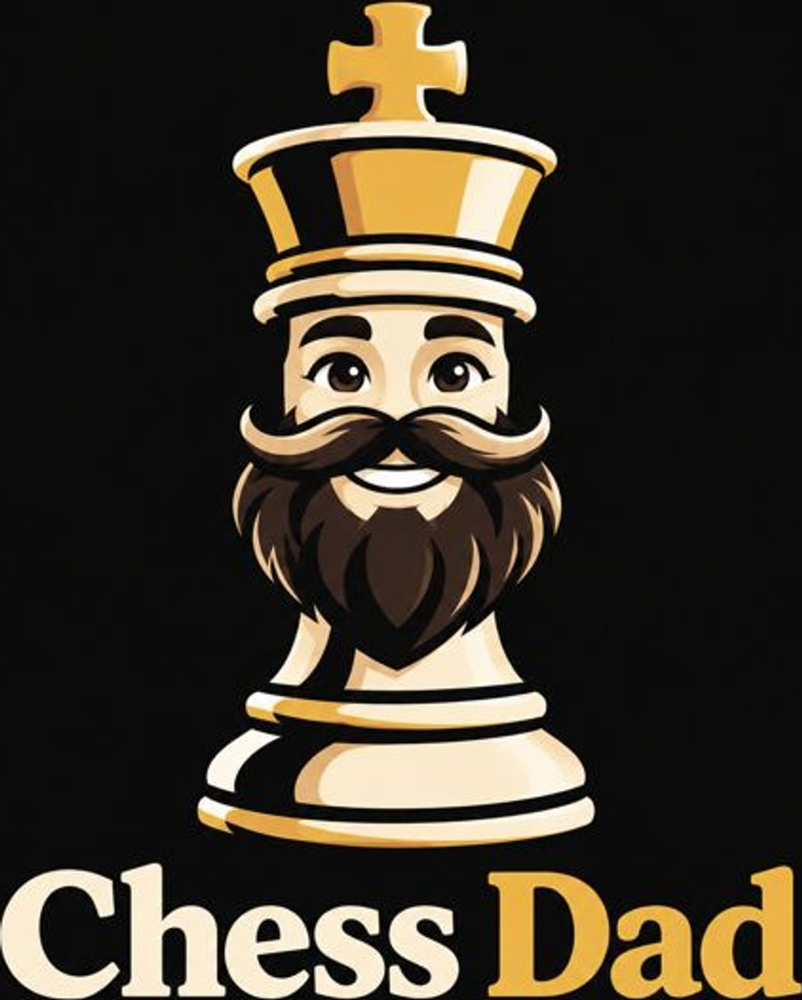

<p align="center">
  
</p>

<h1 align="center">Chess Dad</h1>

An open-source, local-first chess tutor. Connect your **Lichess** and
**Chess.com** accounts, import your games, analyze every move with **Stockfish**,
and get plain-language coaching that turns engine truth into lessons you can
actually use. Think of it as an open alternative to Game Review + Insights +
Coach — with **personalized puzzles built from your own mistakes**.

## What it does

| Feature | Description |
|---|---|
| **Game import** | Fetch your last N games from Lichess and Chess.com (public APIs, no key needed) into a local SQLite database. |
| **Game library** | Search by player/opening/ECO and filter by site, speed, result, colour, analysed state, or date — paginated server-side. |
| **Engine analysis** | Replays every position through Stockfish (UCI), computes centipawn loss, and classifies each move. |
| **Move classification** | Book / forced / brilliant / best / great / good / inaccuracy / mistake / blunder / miss. |
| **Coach feedback** | 2–3 sentence explanations of your critical moments, calibrated to your rating, that *never* contradict the engine. |
| **Weakness profiling** | Aggregates tactical motifs, phase-specific errors, time management, opening performance, and color performance. |
| **Personal puzzles** | Turns your own worst mistakes into drills with spaced repetition (SM-2). |
| **Opening trainer** | Step through main lines or practice them — flags the moment you leave theory, with Wikipedia context. |
| **Insights dashboard** | Accuracy trend, weakness heatmap, opening table, and progress tracking. |
| **Beginner lessons** | A short, plain-language intro to chess — notation, annotation symbols, castling, en passant, promotion, what an engine is, centipawns, why openings and endgames matter, and the core tactics — each with one small puzzle. |
| **OKF knowledge base** | All coaching knowledge lives in a conformant [Open Knowledge Format](https://github.com/GoogleCloudPlatform/knowledge-catalog/blob/main/okf/SPEC.md) v0.2 bundle in [`okf/`](okf/). |

## Stack

- **Next.js 16** (App Router, Turbopack) + **React 19** + **TypeScript**
- **chess.js** (move validation / PGN / FEN) + **react-chessboard** (board UI)
- **Stockfish** (UCI child process) — the only evaluator
- **SQLite** via Node's built-in `node:sqlite` (zero external DB)
- **Recharts** for trends, **Tailwind CSS** for styling
- **AI coaching (optional, per profile)**: OpenAI, Anthropic, Google, DeepSeek, a
  local model via Ollama, or any OpenAI-compatible endpoint. A profile configures
  its own providers in the browser, with its own key; the default analysis is
  always the deterministic coach grounded in the OKF bundle, so no key is needed
  to use the app.

## Getting started

Prerequisites: **Node.js ≥ 22.13** (for `node:sqlite`) and a **Stockfish** binary.

```bash
# 1. Install dependencies
pnpm install

# 2. Install Stockfish (or point STOCKFISH_PATH at your own binary)
node scripts/setup-engine.mjs      # Homebrew on macOS; downloads a build on Linux

# 3. (Optional) copy the example for engine/storage settings
cp .env.example .env.local

# 4. Run
pnpm dev
```

Open http://localhost:3000, enter a Lichess or Chess.com username, import, then
hit **Analyze**. To add an AI coach, open **Profiles**, edit your profile, and add
a provider with your own API key — nothing about AI is configured in the
environment.

## Configuration

All settings are environment variables (see [`.env.example`](.env.example)):

| Variable | Default | Purpose |
|---|---|---|
| `STOCKFISH_PATH` | `stockfish` | Path to the Stockfish binary |
| `ANALYSIS_DEPTH` | `14` | Engine depth per position (14 = fast, 18 = deep) |
| `MAX_GAMES_PER_SOURCE` | `100` | Games fetched per site |
| `LLM_TIMEOUT_MS` | `30000` | Cap on a single AI provider call (AI is configured per profile, not here) |
| `LICHESS_TOKEN` | — | Optional; raises rate limits / enables private games |
| `WORKER_CONCURRENCY` | `min(4, cpus−1)` | Games analysed in parallel by the worker pool |
| `ENGINE_POOL_SIZE` | `WORKER_CONCURRENCY + 1` | Size of the Stockfish process pool |

There are deliberately **no** `LLM_PROVIDER` / `DEEPSEEK_API_KEY` / `OLLAMA_MODEL`
variables. A profile adds its own providers on the Profiles screen; the key stays
in that browser and is sent only with the AI request that uses it.

## How the analysis works

1. **Replay** the game with chess.js to get the FEN before and after every move.
2. **Evaluate** each position with Stockfish. `score cp` is read from the
   side-to-move's perspective; mate scores are mapped to ±100000 cp.
3. **Centipawn loss** for a move by side S is `max(0, E_before − (−E_after))`.
4. **Classify** with the thresholds in
   [`okf/concepts/move-classification.md`](okf/concepts/move-classification.md).
5. **Coach** critical moments (cp loss > 100, or a missed mate/win) with the
   deterministic, OKF-grounded coach. An AI provider can then add a second
   reading of any move or the whole game, on request.
6. **Personalize** — mistakes become puzzles, aggregated into a weakness profile.

## Background jobs (queue + workers)

Engine analysis is the slow, CPU-bound part, so it runs as **jobs** and the app
stays usable while they work:

1. The UI **publishes** jobs to a durable SQLite queue and returns immediately —
   no blocked request. `POST /api/import` stores the fetched games and then
   publishes `analyze` jobs for them; `POST /api/jobs` publishes them directly.
2. A **worker pool** (`WORKER_CONCURRENCY`, default `min(4, cpus−1)`) consumes the
   queue. Each analysed game checks out its own Stockfish process from an engine
   pool, so games run in parallel.
3. The UI **polls** `/api/jobs/status` and renders live progress per job. Pages
   stay responsive (a few milliseconds) throughout — roughly 40 games/minute on a
   12-core machine versus ~6 sequentially.

Fetching is **not** queued: `POST /api/import` does it inline, because that request
is the only place the caller's Lichess token exists. It takes a few seconds with a
token, and then chains into the analysis queue.

Jobs are transactional and leased, so a restart requeues anything interrupted;
failures retry automatically and are surfaced with a one-click retry. See
[`okf/concepts/job-queue.md`](okf/concepts/job-queue.md).

## Identity: profiles live in the browser

There are **no accounts, no user table, and no server-side secret.** A profile is
a small object (`{ name, lichess, chesscom }`) kept in the browser's
`localStorage`, with the acting one in a `cd_profile` cookie that the server reads
on each request. The Lichess token is stored there too and posted with the import
call that needs it — the server holds it for the length of one request and keeps
nothing, so it survives restarts and redeploys with the browser rather than dying
with the process.

The chess is shared, the person is not:

* `games` is global and keyed `(source, external_id)` — two players who played
  each other share **one row and one engine analysis**.
* `library(scope, game_id, player_color)` links an **account** (`lichess:rooronoa`)
  to a game. That is the whole personal model.
* A `library_games` view derives the viewer's colour, opponent, rating and
  accuracy per request, so perspective is computed rather than stored.

The practical effect: set the same account up in a second browser and its games are
already there, already analysed — nothing is re-imported or re-run. Each account
keeps its own puzzle and opening schedules (`puzzle_reviews`, `opening_reviews`).

Because a cookie names the library rather than guarding it, **this is not an auth
boundary** — it is a preference, and the app should be treated as single-tenant.
See [`okf/concepts/profiles-screen.md`](okf/concepts/profiles-screen.md).

Imports run inside their own request rather than on the queue, which is what lets
the token stay in the browser; only engine analysis is queued. See
[`okf/concepts/job-queue.md`](okf/concepts/job-queue.md).

## Design principles

1. **Engine first, AI second** — the model explains engine output; it never
   evaluates positions, so it can't hallucinate chess facts. The deterministic
   coach is the baseline, and AI is an extra reading the user asks for.
2. **Human review before engine review** — a per-game "Your notes" field invites
   you to annotate before you look at the engine.
3. **Pattern over incident** — value comes from recurring mistakes across many
   games, not one game in isolation.
4. **Nothing to leak** — analysis is stored once per game, the deployment keeps no
   user rows, and it never holds a user's token beyond the request that uses it.
5. **Modular engine layer** — the engine wrapper is a thin UCI client; Lc0/Maia
   can be swapped in later (see `src/lib/engine.ts`).
6. **Cost-aware AI** — AI readings are cached by position *and* provider/model, so
   a position is paid for once per model; the default analysis never calls one.
7. **Knowledge base in OKF** — coaching rules, weakness definitions, opening
   notes, and (per-account) progress are stored as an OKF bundle.

## Knowledge base (OKF)

The [`okf/`](okf/) directory is a conformant OKF v0.2 bundle — markdown with
YAML frontmatter, an `index.md`, and relative links. The app reads it (the
offline coach grounds its explanations in `okf/concepts/coaching-rules.md`) and
can write to it (per-account progress). Validate it anytime with:

```bash
uv run .claude/skills/validate/scripts/okf_validate.py okf --strict
# or: python3 .claude/skills/validate/scripts/okf_validate.py okf --strict
```

## Project layout

```
src/lib/            server logic: db, engine (UCI), analysis, llm, llm-providers, importers, weaknesses, puzzles, openings, okf, lessons
src/lib/importers/  Lichess + Chess.com game fetching/parsing
src/app/api/        route handlers: import, games, analyze, ai, insights, puzzles, openings, jobs, profiles, settings
src/app/            pages: home, review/[id], insights, puzzles, openings, profiles, lessons
src/components/     board, eval bar, eval graph, move list, nav, import form, lesson puzzle
okf/                Open Knowledge Format knowledge base (read by the offline coach)
scripts/            setup-engine.mjs, backup-db.mjs, verify-lessons.mjs
test/               node:test suites, run with `pnpm test`
docs/               deployment and Stockfish notes
```

## Testing

```bash
pnpm test              # every unit suite (node:test — no test framework to install)
pnpm verify:lessons    # re-checks every lesson puzzle against chess.js
pnpm verify:engine     # spawns Stockfish and waits for `uciok`
pnpm check             # lint + test + verify:lessons
```

Tests run on Node's built-in runner, so there is no Vitest/Jest dependency.
`test/loader.mjs` teaches Node's resolver the two things the bundler does for free
— extensionless imports and the `@/…` alias — which is what lets the suites import
the app's TypeScript directly. `--conditions=react-server` is passed so the
`server-only` marker resolves to its empty build, the way it does on the server.

The persistence and queue suites run against a **real** SQLite database in a temp
directory (`test/helpers/db.ts`), not a mock, because the behaviour that matters —
the `UNIQUE(source, external_id)` upsert, the `library_games` perspective, lease
accounting — is the database's, not the code's.

## Operating a deployment

**Logs.** One JSON object per line on stdout (`src/lib/log.ts`), which is what
`railway logs` and any collector want. `LOG_LEVEL` selects verbosity. Job
lifecycles, engine spawns and exits, imports and backups are all logged; the
worker's repetitive failures are rate-limited so a persistent fault cannot bury
everything else. Credential-shaped fields are redacted before they are written.

**Health.** `GET /api/health` returns `200` or `503`, and is what the container
health check and the platform's rollout gate use. It checks the database is
readable and writable, that disk is not full, that the worker pool is not idle
with work waiting, and — the one that matters — that **Stockfish actually answers
`uciok`**, cached for `HEALTH_ENGINE_TTL_MS`. That last check exists because the
app will happily boot and serve pages with no engine at all, failing every
analysis job on a 60-second timeout.

**Backups.** `pnpm run backup` takes a verified snapshot with `VACUUM INTO` and
prunes old ones:

```bash
pnpm run backup                                  # uses CHESSDAD_DB_PATH
pnpm run backup -- --out /backups --retention 14
pnpm run backup -- --list
```

The same snapshot runs on a timer in-process (`BACKUP_INTERVAL_MS`, default 6h;
`BACKUP_INTERVAL_MS=0` disables it). Every snapshot is reopened and checked with
`PRAGMA integrity_check` **before** older copies are pruned, so a corrupt backup
can never displace a good one.

> A copy on the same volume is not a real backup — it survives a bad write or a
> mistaken delete, but not losing the volume. Point `--out` (or `BACKUP_DIR`) at a
> mounted bucket or a synced directory for an off-box copy.

## What AI coaching costs

The default costs nothing. Every game is coached by the offline, OKF-grounded
coach, which is deterministic and needs no key. AI is **opt-in per profile**: a
user adds a provider on the Profiles screen, and the review screen's **Deeper
analysis (AI)** panel explains one move or every flagged move in a game.

That changes who pays. The key belongs to the user and is never stored on the
server, so AI spend is theirs — there is no deployment-wide LLM budget to protect.

Every call still logs its counts plus a running total, so a cost question has an
answer:

```bash
railway logs | grep 'llm: call'     # promptTokens, completionTokens, cumulativeTokens
pnpm run estimate:llm               # project the cost for this database
pnpm run estimate:llm -- --model deepseek-v4-pro
```

Measured on real positions through this app's own prompt: **~485 tokens per
explanation** (289 in, 196 out), and **~6.6 explanations per game** — only critical
moments with an engine best move get one. At `deepseek-flash` rates that is about
**$0.001–0.002 per game**, so 1,000 games is roughly $1–2 and 10,000 games roughly
$11–21 (off-peak / peak). Prices and the peak-hour window are in
`scripts/estimate-llm-cost.mjs`; check them against
<https://api-docs.deepseek.com/quick_start/pricing/> before trusting a projection.

Two things keep this cheap, and both are structural rather than tuning:

* **The cache is keyed by position *and* provider + model** — the FEN, the move
  played, the classification, and a 200-point rating band. A position is paid for
  once *per model*, and every later analysis with that model is free. A different
  model is a different call, and its reading is kept beside the first, which is
  what lets a user compare providers.
* **Only what the user asks for is explained** — one move, or the flagged ones
  (roughly one position in five).

The failure mode to watch is not your bill, it is the user's quota: `POST
/api/games/[id]/ai` spends the caller's own key, so an unauthenticated deployment
lets any visitor drive it. Put the app behind an access gate (see
[`PRODUCTION-READINESS.md`](PRODUCTION-READINESS.md)) before exposing it.

## Deploying

The repository ships a `Dockerfile` and a `railway.json`, and the image installs
the **same pinned Stockfish** as local development (`pnpm run setup:engine`), so a
laptop and production run identical engines. See
[`docs/updating-stockfish.md`](docs/updating-stockfish.md) for bumping it.

Two things are not optional on a real host:

* **A volume.** Point `CHESSDAD_DB_PATH` at a mounted volume
  (`/data/chessdad.db`). The default is `./data/chessdad.db` relative to the
  working directory, which on a container with an ephemeral filesystem is thrown
  away on every redeploy — silently destroying every imported game and every hour
  of analysis behind it.
* **The engine.** `STOCKFISH_PATH`, unless `stockfish` is on `PATH`. Boot logs
  loudly if it cannot start, and `/api/health` returns 503.

| Variable | Default | Purpose |
|---|---|---|
| `CHESSDAD_DB_PATH` | `./data/chessdad.db` | **Set this to a volume path in production.** |
| `STOCKFISH_PATH` | `stockfish` | Path to the engine binary |
| `LOG_LEVEL` | `info` | `debug` \| `info` \| `warn` \| `error` |
| `HEALTH_ENGINE_TTL_MS` | `60000` | How long an engine probe is cached |
| `BACKUP_INTERVAL_MS` | `21600000` | Snapshot interval; `0` disables |
| `BACKUP_DIR` | `<db dir>/backups` | Where snapshots go |
| `BACKUP_RETENTION` | `7` | How many snapshots to keep |
| `ENGINE_IDLE_MS` | `300000` | Kill an idle engine after this; `0` never |
| `CHESSDAD_DISABLE_WORKER` | — | `1` makes this replica web-only |

## Roadmap

- **Phase 2**: Lc0/Maia "human-like" mode, deeper weakness heatmaps, opening
  repertoire builder, chat-based per-position Q&A, full ECO catalogue (12,379
  openings).
- **Phase 3**: parallel engine instances, cross-provider AI reading comparison,
  PGN export with annotations, community comparisons.

## Troubleshooting

* **"Lichess throttled the game export"** — Lichess limits *anonymous* game
  exports to a few requests per minute and can mask the throttle as a `404` even
  for valid accounts. Add a personal API token on the **Profiles** tab — it is
  saved in your browser and sent only with the import (or set `LICHESS_TOKEN` in
  `.env.local` for a headless install); authenticated limits are several times
  higher. Create one at <https://lichess.org/account/oauth/token> — no scopes
  are needed to read public games.
* **Chess.com returns 403** — the Chess.com API requires a `User-Agent` header.
  Chess Dad sends one automatically, but a proxy that strips it will fail.

## License

MIT. Built on open components: Stockfish (GPLv3), chess.js (MIT), react-chessboard (MIT).
